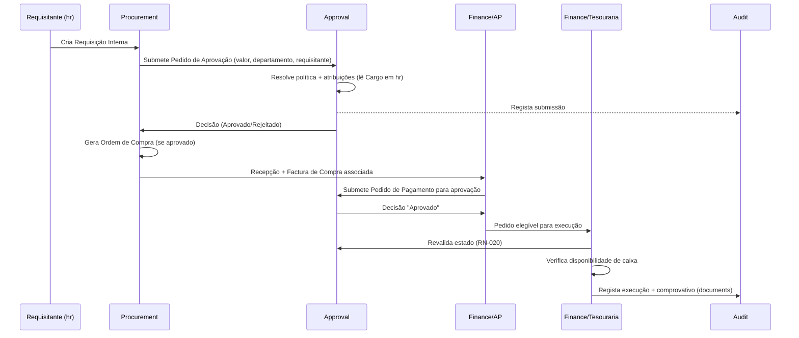
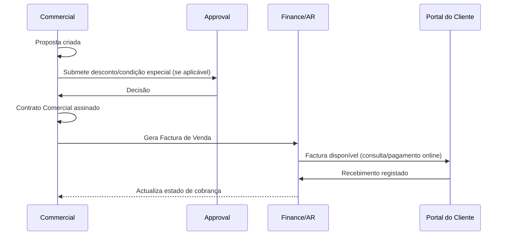
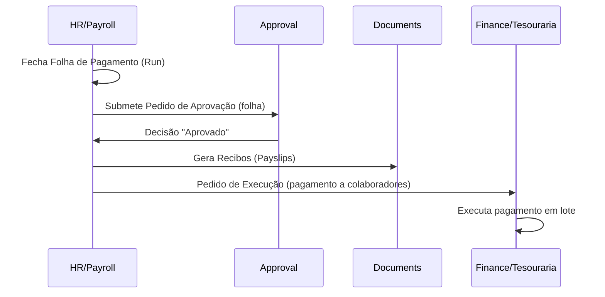
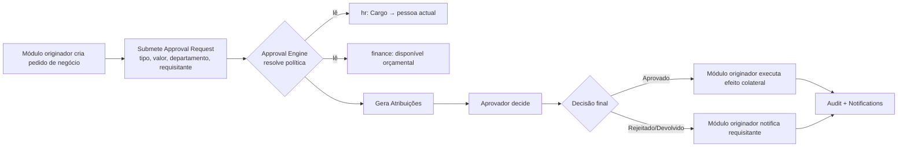

# Rivo Suite — Esquema de Dados, Integrações Externas e Segurança

**Versão:** 1 — substitui o plano anterior (deep-dive ao Approval Engine); segue as três frentes pedidas pelo cliente.
**Fontes de verdade usadas, conforme instruído:** `rivo-arquitetura-global-v1.md` (domínio, capacidades, ownership, dependências) e `rivo-suite-descricao-modulos.md` (produto).

**Resoluções aplicadas:** este documento incorpora as resoluções **R1–R5** da secção 10 de `rivo-arquitetura-global-v1.md`. Onde o texto original desta v1 as contradizia (RLS como sede da invariante; FK polimórfica em `documents`), foi corrigido em linha. R1–R5 prevalecem sobre qualquer texto remanescente que as contrarie.

**Nota de transparência sobre âmbito:** `rivo-arquitetura-solucao-v1.md` (mapa de módulos detalhado, ADRs, deployment) deixou de ser tratado como base — este documento não assume essa estrutura granular. No entanto, as sete decisões que o cliente fechou directamente nesta conversa (D1–D7: Auth≠Authz, Cargo≠Perfil, Budget≠Custos Departamentais, Department≠Cost Center, Documentos transversal, sem multi-tenancy, contratos por contexto) continuam a ser factos vivos desta conversa, não apenas conteúdo de um documento — por isso são aplicadas aqui como restrições de desenho, mesmo não estando escritas nos dois ficheiros-fonte. Onde isso colide com o texto do documento de produto (que ainda descreve "multi-tenant" como característica da plataforma), a decisão do cliente prevalece, e a colisão fica assinalada explicitamente.

---

## 1. Esquema da Base de Dados e Fluxo de Dados

### 1.1 Princípios de modelação

- **Um schema lógico PostgreSQL por domínio**, com ownership de tabela exclusivo — nenhum domínio escreve directamente em tabelas de outro.
- **Sem `tenant_id` nem partição multi-tenant** (decisão fechada, single-company).
- **Row-Level Security como segunda linha de defesa** para segregação de funções, não por isolamento de tenant — por exemplo, só a pessoa atribuída a uma decisão de aprovação pendente pode escrevê-la. **A invariante vive no domínio `approval`, não na política RLS (R2).** Nenhuma regra de negócio pode existir apenas em RLS.
- **FK entre schemas apenas para a chave primária do contexto dono (R5)** — sem `JOIN` a outras tabelas desse contexto; atributos lêem-se pelo contrato publicado.
- **Chaves substitutas (UUID)** em todas as entidades, consistente com o que já é prática confirmada no domínio (evita expor sequências previsíveis, facilita eventual extracção futura de um domínio).
- **Trilha de auditoria por referência (`entity_type` + `entity_id`)**, nunca duplicada dentro de cada domínio — todos os domínios escrevem para o mesmo serviço/tabela de Auditoria (capacidade transversal).
- **Controlo de concorrência optimista** (coluna `version` ou verificação de estado antes de escrever) em qualquer entidade decidida por mais de uma pessoa — nomeadamente decisões de aprovação e execução de pagamento.
- **Sem eliminação física** em entidades sujeitas a auditoria ou retenção legal (decisões, pagamentos, documentos fiscais) — apenas anulação lógica, auditada.

### 1.2 Esquema lógico por domínio

#### `identity` — Identidade & Acesso (Auth = infra; Autorização = domínio partilhado, D1)

| Entidade | Atributos principais | Relacionamentos |
|---|---|---|
| Utilizador | id, email, hash_password, mfa_activo, estado | 1:N com Atribuição de Perfil |
| Perfil de Acesso | id, nome (Admin/Manager/Finance/HR/Sales/Asset Manager/Project Manager) | catálogo fixo, referenciado por Atribuição de Perfil |
| Atribuição de Perfil | id, utilizador_id (FK), perfil_id (FK) | liga Utilizador a Perfil — um utilizador pode ter mais de um perfil |
| Sessão | id, utilizador_id (FK), criada_em, expira_em, ip | suporta expiração por inactividade |

**Nota de fronteira:** este schema **não** contém Cargo (organizacional) — isso pertence a `hr` (secção seguinte), por decisão D2. Evita que Autorização se torne um segundo ponto de dados organizacionais.

#### `hr` — Recursos Humanos (ciclo de vida do colaborador, inclui Cargo e Department por D2/D4)

| Entidade | Atributos principais | Relacionamentos |
|---|---|---|
| Colaborador | id, utilizador_id (FK, **opcional** — nem todo colaborador tem login), nome, dados pessoais, estado, data_admissão | N:1 com Departamento; N:1 com Cargo |
| Departamento | id, nome, gestor_id (FK Colaborador) | organograma — **distinto** de Cost Center (D4) |
| Cargo | id, nome (ex.: "Chefe de Departamento", "DAF", "Director Financeiro", "CEO", "CFO"), nível hierárquico | catálogo organizacional — **distinto** do Perfil de Acesso (D2); usado pelo Approval Engine para resolver aprovadores |
| Atribuição de Cargo | id, colaborador_id (FK), cargo_id (FK), desde, até | permite histórico — um cargo é ocupado por alguém num período, não uma coluna fixa em Colaborador |
| Contrato de Trabalho | id, colaborador_id (FK), tipo, data_início, data_fim, salário base | pertence a RH (D7) |
| Férias / Assiduidade / Benefícios / Recrutamento / Onboarding-Offboarding | (entidades próprias, consultar módulo) | todas referenciam Colaborador |

#### `payroll` — Payroll & Compensação

| Entidade | Atributos principais | Relacionamentos |
|---|---|---|
| Folha de Pagamento (Run) | id, período, estado | 1:N com Item de Folha |
| Item de Folha | id, run_id (FK), colaborador_id (FK, referência a `hr`), vencimentos, descontos | — |
| Recibo (Payslip) | id, item_id (FK) | gerado via `documents` (secção seguinte) |

**Aprovação da folha** não tem tabela própria neste schema — é um Approval Request submetido ao domínio `approval` (evita reproduzir o padrão do protótipo, onde `payroll_approval_steps` duplicava o motor genérico).

#### `finance` — Financeiro (Contas a Pagar, Tesouraria, Contas a Receber, Contabilidade, Planeamento)

| Entidade | Atributos principais | Relacionamentos |
|---|---|---|
| Factura de Venda | id, cliente_id (FK, referência a `commercial`), valor, estado | Contas a Receber |
| Recebimento | id, factura_id (FK), valor, meio, data | Contas a Receber |
| Factura de Compra | id, fornecedor_id (FK, referência a `procurement`), purchase_order_id (FK), valor, estado | Contas a Pagar |
| Pedido de Pagamento | id, factura_compra_id (FK, opcional), beneficiário, valor, moeda, categoria, **estado limitado a `elegível`/`executado`** — sem passos de aprovação embutidos | a decisão vive em `approval`, não aqui (correcção directa ao anti-padrão do protótipo) |
| Execução de Pagamento | id, pedido_pagamento_id (FK), data, meio, referência, comprovativo (via `documents`) | só é criável se o Approval Engine confirmar decisão "Aprovado" — revalidado no momento (RN-020 do SGAP) |
| Disponibilidade de Tesouraria | id, conta_bancária_id (FK), saldo_disponível, actualizado_em | consultada antes de qualquer Execução de Pagamento |
| Conta Bancária | id, banco, iban, moeda | — |
| Centro de Custo | id, código, nome, departamento_id (FK **opcional**, referência a `hr`), responsável_id (FK Colaborador) | **distinto** de Departamento (D4); mapeamento não obrigatório |
| Orçamento (Budget) | id, ano_fiscal, cost_center_id (FK), estado | tecto de controlo — **distinto** de Previsão de Custos Departamentais (D3) |
| Linha de Orçamento | id, budget_id (FK), mês, valor | — |
| Previsão de Custos Departamentais | id, departamento_id (FK, referência a `hr`), mês, custos_operacionais, custos_fixos, estado | input mensal ao carregamento de caixa — **entidade distinta de Orçamento** (D3), relacionada por referência ao mesmo período/departamento, nunca fundida |
| Plano de Contas | id, código, nome, tipo, pai_id (FK, hierárquico) | Contabilidade |
| Lançamento Contabilístico | id, data, descrição, referência | Contabilidade |
| Linha de Lançamento | id, lançamento_id (FK), conta_id (FK), débito/crédito | Contabilidade |

#### `procurement` — Procurement (Procure-to-Pay)

| Entidade | Atributos principais | Relacionamentos |
|---|---|---|
| Fornecedor | id, nome, nif, iban, contactos, estado | **dono confirmado** (secção 3 do doc. global); consumido por `finance` |
| Requisição Interna | id, requisitante_id (FK, referência a `hr`), departamento, justificação, estado | Approval Request submetido a `approval` |
| Ordem de Compra | id, requisição_id (FK), fornecedor_id (FK), estado | gerada só após requisição aprovada |
| Recepção de Mercadoria | id, ordem_compra_id (FK), quantidades recebidas | alimenta o 3-way match |

#### `commercial` — Comercial / CRM

| Entidade | Atributos principais | Relacionamentos |
|---|---|---|
| Cliente | id, nome, contactos, nif | **dono confirmado**; consumido por `finance` (AR) e Portal do Cliente |
| Lead / Oportunidade (Deal) | id, cliente_id (FK, opcional), estágio, valor | Pipeline |
| Proposta | id, oportunidade_id (FK), valor, estado | pode gerar Approval Request (descontos) |
| Contrato Comercial | id, proposta_id (FK), cliente_id (FK), valor, SLA | pertence a Comercial (D7) — não se funde com Contrato de Trabalho nem com "documento legal" |
| Acção de Cobrança | id, factura_id (FK, referência a `finance`), tipo, data | Cobranças |

#### `approval` — Governança de Decisões (Approval Engine)

| Entidade | Atributos principais | Relacionamentos |
|---|---|---|
| Política de Aprovação | id, tipo_processo, cargo/departamento/faixa_valor, activa | referencia Cargo (`hr`) por id, nunca duplica o catálogo |
| Passo da Política | id, política_id (FK), ordem, modo (sequencial/paralelo), candidato_a_aprovador (cargo ou pessoa), sla_horas | — |
| Pedido de Aprovação | id, tipo_processo, origem_tabela, origem_id, requisitante_id, valor, departamento — **todos congelados na submissão** | referencia a política aplicada por *snapshot*, não por FK viva |
| Atribuição | id, pedido_id (FK), pessoa_concreta_id (FK, resolvida na submissão, não recalculada) | — |
| Decisão | id, atribuição_id (FK), acção, autor, data, notas, **imutável** | — |
| Delegação | id, delegante_id, delegado_id, período, estado | auditada |

*(Modelo consistente com o já discutido nas análises específicas do Approval Engine — aqui apresentado apenas como parte do esquema global, sem aprofundar semântica de SLA/invariantes, que fica para a fase de desenho detalhado desse motor.)*

#### `audit` — Auditoria (capacidade única, corrige a duplicação do protótipo)

| Entidade | Atributos principais |
|---|---|
| Evento de Auditoria | id, utilizador_id, entidade_tipo, entidade_id, acção, valor_anterior (jsonb), valor_novo (jsonb), **ip**, correlation_id, criado_em |

Nota directa ao gap encontrado no protótipo: a coluna **ip** é obrigatória por desenho aqui — o `audit_logs` do protótipo não a tinha, o que era uma lacuna face ao requisito de auditoria absorvido do SGAP.

#### `notifications` — Notificações

| Entidade | Atributos principais |
|---|---|
| Notificação | id, destinatário_id, tipo, título, mensagem, lida, criado_em |
| Preferência de Notificação | id, destinatário_id, canal, frequência |

#### `documents` — Documentos/Anexos (capacidade transversal, D5, absorve "documento legal" de D7)

| Entidade | Atributos principais | Relacionamentos |
|---|---|---|
| Documento | id, categoria (inclui `legal`, `fiscal`, `rh`, `comprovativo`, etc.), ponteiro_storage, hash, versão, criado_por | **não referencia nenhum domínio** — a ligação vive no contexto de origem (R3) |
| Modelo de Documento (Template) | id, categoria, corpo, versão | usado por RH (declarações), Financeiro (documentos fiscais) |

**Ligação a registos de negócio (R3):** cada contexto consumidor possui a sua própria tabela de ligação, com FKs reais para o seu registo e para `documents.documento(id)` — por exemplo `hr.colaborador_documento`, `finance.execucao_pagamento_comprovativo`. Isto substitui a FK polimórfica `entidade_tipo`+`entidade_id` da versão anterior, restaura integridade referencial e mantém a **retenção legal no contexto que a conhece**.

**Nota directa a D7:** "documento legal" não é uma tabela `legal_contracts` própria — é um Documento com `categoria = legal`, ligado ao Contrato de Trabalho ou ao Contrato Comercial pela tabela de ligação do respectivo contexto (`hr` ou `commercial`).

#### `fiscal` — Fiscal & Compliance

| Entidade | Atributos principais |
|---|---|
| Declaração Fiscal | id, tipo (IVA/IRT/INSS/AGT), período, estado, gerado_em |
| Exportação SAF-T | id, período, ficheiro (via `documents`) |

#### `projects`, `fleet`, `inventory` — auto-contidos

Cada um com as suas entidades operacionais próprias (tarefas/timeline; viaturas/viagens/manutenção; activos/armazéns/contagens), todas referenciando `hr.colaborador(id)` e `finance.centro_custo(id)` por FK à chave primária apenas (R5) — sem tabelas partilhadas e sem `JOIN` a outras tabelas desses contextos.

Atributos de Colaborador (nome, departamento, cargo actual) lêem-se pelo contrato `ReferenciaColaborador` publicado por `hr` (R4), nunca por consulta directa às tabelas de `hr` e nunca por cópia para tabelas próprias.

### 1.3 Fluxos de dados — processos ponta-a-ponta

#### (a) Procure-to-Pay com aprovação e execução

#### (b) Order-to-Cash (Comercial → Financeiro)

#### (c) Payroll (aprovação convergida no motor único)

#### (d) Padrão genérico de submissão a aprovação (aplica-se a Despesas, Férias, Descontos, etc.)

---

## 2. Integração com APIs Externas e Serviços de Terceiros

### 2.1 Princípio arquitectural

Cada integração externa é isolada por um **adaptador (Anti-Corruption Layer)** dentro do domínio que a necessita — nenhum domínio interno depende directamente do formato de dados de um serviço externo. O domínio expõe/consome a sua própria interface interna; o adaptador traduz de/para o serviço terceiro. Isto evita que uma mudança de API externa (ex.: o portal da AGT, ou um banco) se propague para a lógica de negócio.

### 2.2 Mapa de integrações

| Integração | Domínio responsável | Direcção | Mecanismo provável | Estado |
|---|---|---|---|---|
| **AGT — Administração Geral Tributária** (declarações fiscais) | `fiscal` | Saída (submissão/geração) | Geração de ficheiro/relatório para submissão — **hipótese**: não há confirmação, nos documentos-fonte, de uma API oficial da AGT; tratar inicialmente como geração de documento para submissão manual/portal, não como chamada de API directa | Hipótese a validar |
| **SAF-T AO** (Standard Audit File for Tax) | `fiscal` | Saída (exportação de ficheiro) | Geração de ficheiro XML no formato SAF-T AO — é uma exportação estruturada, não uma API síncrona | Facto (capacidade explícita no doc. de produto) |
| **Banca — reconciliação bancária** | `finance` (Tesouraria) | Entrada (extractos) | Import de extracto (ficheiro OFX/CSV/MT940 ou API do banco, conforme disponibilidade de cada instituição angolana) — **hipótese sobre o mecanismo exacto**, o doc. de produto confirma a capacidade ("reconciliação bancária automática e manual") mas não o protocolo | Facto (capacidade) / Hipótese (mecanismo) |
| **Banca — iniciação de pagamentos electrónicos** | `finance` (Tesouraria) | Saída | Fora do âmbito imediato — o próprio SGAP (fonte incorporada no doc. global) regista isto como integração de "Fase 2" | Hipótese / roadmap futuro, não v1 |
| **Câmbio (FX) multi-moeda AOA/USD/EUR** | `finance` | Entrada (taxas) | Feed de taxas de câmbio — candidato natural é o Banco Nacional de Angola (BNA) como fonte de referência, dado o contexto angolano do produto | Hipótese — capacidade multi-moeda é facto (doc. de produto); fonte exacta da taxa não está confirmada |
| **E-mail (notificações)** | `notifications` | Saída | Provider de e-mail transaccional (SMTP ou API — ex. categoria de serviço, não um fornecedor específico ainda decidido) | Facto (capacidade "dashboard+e-mail") / Hipótese (fornecedor) |
| **Gateway de pagamento online** (Portal do Cliente) | `finance` (AR) via `commercial`/Portal | Saída/Entrada (callback) | Gateway de pagamento local — a confirmar fornecedor (ex. soluções de pagamento móvel/cartão disponíveis no mercado angolano) | Facto (capacidade "pagamentos online" no doc. de produto) / Hipótese (fornecedor) |
| **Modelos de IA** (previsões, alertas inteligentes, assistente) | `analytics` (read-model) | Saída (chamada a modelo) | API de um provider de IA/ML — chamada assíncrona (background job), nunca no caminho crítico de um pedido HTTP de negócio | Facto (capacidade explícita) / Hipótese (fornecedor) |
| **Object Storage** (para `documents`) | `documents` | Entrada/Saída | Serviço de armazenamento de objectos (S3-compatível ou equivalente) | Inferência — decorre directamente de D5 (Documentos como capacidade transversal), não citado por nome nos docs-fonte |
| **Importação/Exportação CSV** | Todos os domínios que expõem esta função (RH, Financeiro, etc.) | Entrada/Saída | Upload/download de ficheiro, processado como background job para volumes grandes | Facto (capacidade explícita "Importação de dados em massa via CSV") |
| **Software de contabilidade externo / banca electrónica** | `finance` | Saída (futura) | Integração explicitamente identificada como Fase 2 na fonte SGAP incorporada no doc. global — **não é requisito da v1** | Facto (intenção futura) — fora do âmbito da v1 |

### 2.3 Padrões transversais para todas as integrações externas

- **Idempotência obrigatória** em qualquer operação de saída que possa ser repetida (ex.: reenvio de notificação, reprocessamento de exportação SAF-T) — usar chave de idempotência por operação.
- **Retries com backoff** para chamadas que falhem por indisponibilidade transitória do serviço terceiro; nunca bloquear o pedido HTTP original à espera de uma integração externa — todas correm como background job (consistente com o princípio já estabelecido de não bloquear o caminho crítico).
- **Webhooks de entrada** (ex.: confirmação de um gateway de pagamento) tratados por um endpoint dedicado por integração, que valida a assinatura/autenticidade do webhook antes de qualquer processamento, e que só desencadeia efeitos de domínio através da interface interna do domínio responsável (nunca escreve directamente nas tabelas de negócio a partir do handler do webhook).
- **Segredos de API** geridos por um serviço de segredos/variáveis de ambiente — nunca em código nem em migrações de base de dados.
- **Ambientes separados** (sandbox/produção) para qualquer integração que o forneça (pagamentos, banca), com configuração explícita por ambiente.
- **Circuit breaker** para integrações críticas ao negócio (ex.: se o gateway de pagamento cair, o Portal do Cliente deve degradar graciosamente — mostrar indisponibilidade temporária — não falhar o resto da aplicação).

---

## 3. Padrões de Segurança e Autenticação de Utilizadores

### 3.1 Autenticação (infraestrutura, D1)

- Autenticação individual por utilizador — sem contas partilhadas.
- **MFA obrigatório** para perfis que decidem ou movimentam fundos (Direcção Geral/equivalente, CEO, CFO, Finanças/Tesouraria) — herdado directamente da fonte SGAP incorporada no doc. global; aplicável a qualquer papel com poder de aprovação ou execução financeira, não só aos nomeados literalmente no SGAP.
- Password com política robusta (comprimento mínimo, complexidade) e **hash forte** (bcrypt/argon2) — nunca reversível.
- **Sessões com expiração por inactividade** (o SGAP fonte indicava 15 minutos para perfis decisórios — aplicável aqui como referência de partida, a confirmar com o cliente se deve ser uniforme ou por perfil).
- Sessão única reforçada (impedir múltiplas sessões activas em simultâneo) para perfis decisórios sensíveis, configurável.

### 3.2 Autorização (domínio partilhado, D1)

Duas dimensões independentes, nunca confundidas (D2):

| Dimensão | Responde a | Dono | Usada para |
|---|---|---|---|
| **Perfil de Acesso** | "O que este utilizador pode ver/fazer no sistema?" | `identity` | Visibilidade de módulos, permissões de CRUD por ecrã |
| **Cargo** | "Que posição organizacional ocupa esta pessoa?" | `hr` | Resolução de aprovadores no Approval Engine, segregação de funções por processo |

**Regra de imposição:** toda a verificação de autorização é feita no servidor/base de dados — nunca só na interface. Isto corrige directamente o padrão de falha identificado no protótipo (a política de escrita em tabelas de aprovação era "qualquer membro autenticado", com a verificação real só no frontend).

**Segregação de funções:** implementada como regra de código no domínio `approval` (não como configuração alterável por administrador) — no mínimo, quem submete um pedido nunca pode decidir sobre ele. Regras adicionais mais específicas (ex. "quem valida não aprova, quem aprova não paga") ficam para a fase de desenho detalhado do Approval Engine, mas o mecanismo de imposição (código, não dados; servidor, não interface) já fica decidido aqui.

**Relação com RLS (R2):** o domínio é a fonte de verdade da regra; a política RLS correspondente é defesa em profundidade e tem de ser o reflexo de uma invariante já expressa e testada no domínio. Uma regra que exista apenas em RLS é um defeito de arquitectura.

**Sem acumulação de papéis conflituantes no mesmo processo** — verificado ao nível do Pedido de Aprovação, não do sistema global (uma pessoa pode ter vários perfis/cargos no sistema; o que não pode é intervir mais do que uma vez, em papéis conflituantes, no mesmo processo).

### 3.3 Protecção de dados

- **TLS em trânsito** para toda a comunicação cliente-servidor e servidor-integrações externas.
- **Cifra em repouso** para dados sensíveis e anexos (AES-256) — aplica-se em particular a `documents` e a campos financeiros/pessoais sensíveis em `hr`.
- **Minimização de dados** e prazos de retenção — alinhado com a Lei n.º 22/11 de Protecção de Dados Pessoais (Angola), referida na fonte SGAP incorporada no doc. global — exceptuando onde a retenção legal obriga o contrário (auditoria: mínimo 10 anos; documentos fiscais: prazos legais angolanos).
- **Sem eliminação física** de dados sujeitos a auditoria ou obrigação fiscal — apenas anulação lógica.

### 3.4 Segurança de API

- Todos os endpoints exigem autenticação e autorização explícitas — nenhum endpoint "aberto por omissão".
- **Nunca expor entidades de domínio directamente** — API expõe DTOs/contratos próprios, não as tabelas internas (princípio já estabelecido para a comunicação entre módulos, aplica-se também à API externa).
- Rate limiting por utilizador/IP, particularmente em endpoints de autenticação (mitigação de força bruta) e em endpoints que desencadeiam integrações externas (evita amplificação de custo/carga sobre terceiros).
- Validação de input em todos os endpoints, com mensagens de erro que não revelem detalhes internos do sistema.
- Correlation ID por pedido, propagado para logs e para a Auditoria — permite reconstruir uma cadeia de acções entre módulos.

### 3.5 Auditoria de segurança

- Toda a tentativa de acção não autorizada é **registada explicitamente** (não apenas bloqueada silenciosamente) — ex.: tentativa de executar um pagamento não aprovado, tentativa de aprovar acima da alçada.
- Alterações de configuração (perfis, regras de aprovação, parâmetros do sistema) são auditadas com a mesma disciplina que transacções de negócio.
- O log de auditoria de segurança usa a mesma capacidade transversal `audit` (secção 1.2) — não uma tabela de segurança separada, para não reproduzir o padrão de duplicação já identificado no protótipo.

### 3.6 Nota sobre multi-tenancy e segurança (D6)

Sem isolamento multi-tenant na v1, a superfície de risco muda de forma relevante face ao protótipo original (que assumia RLS por tenant como primeira linha de defesa): a primeira linha de defesa passa a ser inteiramente **autorização por perfil/cargo/processo** (secção 3.2), não isolamento de dados por organização.

Como já não existe uma fronteira de tenant a compensar eventuais falhas de autorização, a segregação de funções tem de ter também uma imposição ao nível dos dados (ex.: RLS por atribuição de aprovação). Nos termos de **R2**, essa política é **segunda linha de defesa** — reflexo de uma invariante que vive e é testada no domínio `approval`, nunca a sua única sede.

---

## Próximo passo

Este documento fecha o desenho de dados, integrações e segurança ao nível de arquitectura. Fica disponível para os próximos passos que o cliente definir — nomeadamente, se desejado, o aprofundamento do modelo de dados definitivo do Approval Engine dentro deste esquema, ou a passagem à definição de contratos de API (OpenAPI) por domínio.
